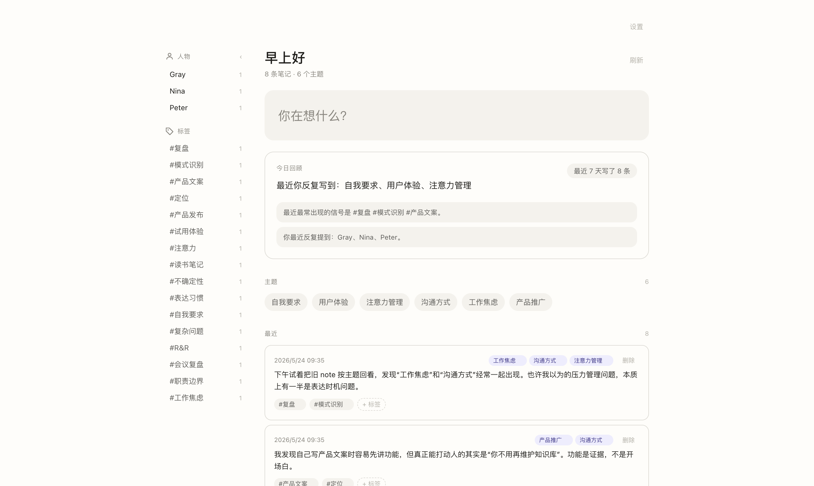

# DailyNote

DailyNote is a local-first AI notes app for people who write messy daily notes.

You write freely. DailyNote turns scattered notes into themes, tags, people, related memories, and a Daily Brief you can actually revisit.

It is not another system that asks you to maintain folders, tags, backlinks, and dashboards. DailyNote acts more like a quiet research assistant: it reads what you wrote, finds recurring patterns, connects old thoughts, and gives you a useful review when you come back.



## Why Try It

- **Write and move on**: capture thoughts quickly without deciding where they belong.
- **Automatic organization**: AI extracts themes, tags, people, and related old notes.
- **Daily Brief home**: the home screen reads like an active review, not a cold analytics table.
- **Local Markdown**: notes stay as Markdown files that you can open with Obsidian, VSCode, or any editor.
- **Your data stays yours**: choose your own data directory, including iCloud, Dropbox, or another synced folder.
- **Bring your own AI provider**: supports OpenAI, Anthropic, and OpenAI-compatible providers for local or third-party models.

## Who It Is For

DailyNote is useful if you:

- Write scattered notes every day but do not want to maintain a complex knowledge base.
- Have many notes but rarely revisit them or notice long-running patterns.
- Want AI-assisted organization without locking your notes into a closed platform.
- Prefer Markdown, local files, and portable data.

If you need mature team collaboration, rich-text editing, permissions, or mobile sync, DailyNote is not there yet. It is currently best for personal knowledge work and early adopters.

## Current Status

DailyNote is an early macOS desktop app built with Next.js and Electron. The core workflow is already usable:

- Quick capture
- Daily Brief home
- Automatic themes and tags
- Concept pages
- People pages
- Ask questions about your notes
- Local data directory
- AI provider settings
- macOS menu bar entry and global shortcut

## Install

If a macOS build is available in GitHub Releases, download it and open the app. On first launch, configure your AI provider and API key in Settings.

If there is no release yet, run it from source:

```bash
npm install
npm run desktop:dev
```

If the app is unsigned, macOS may block it on first launch. You can allow it in System Settings, or build it from source.

## Local Development

Requirements: Node.js 18+ and npm.

```bash
npm install
cp .env.example .env.local
npm run desktop:dev
```

You can also skip `.env.local` and configure the provider and API key inside the app.

`npm run dev` only starts the Next.js web server and is mainly useful for debugging pages. For normal desktop development, use:

```bash
npm run desktop:dev
```

## Build The macOS App

```bash
# Build a distributable macOS app
npm run desktop:build

# Build an unsigned local app directory for quick checks
npm run desktop:pack
```

Build outputs are written to `dist/`. For public distribution, signing and notarization are recommended; unsigned apps may be blocked by macOS when shared with other users.

## Data And Privacy

DailyNote stores data on the local file system. Your notes are not committed to the repository; `data/` is ignored by default.

The data directory looks like this:

```text
DATA_DIR/
  notes/          original notes
  concepts/       generated concept pages
  people/         people indexes
  analysis/       AI analysis results
  note-links/     relationships between notes
  purpose.md      your long-running insight goal
```

You can choose your data directory in the app. When running the web version in development, you can also set it in `.env.local`:

```bash
DATA_DIR=/Users/you/Library/Mobile Documents/com~apple~CloudDocs/dailynote-data
```

Important: if you use a cloud AI provider, note content is sent to that provider for analysis. You decide whether to use OpenAI, Anthropic, a local model, or another compatible endpoint.

## Product Principles

**Do not make users maintain a knowledge base.**
Many note-taking tools turn organization into user labor: folders, tags, backlinks, dashboards. DailyNote goes the other way: users write, the system organizes.

**Files should outlive the app.**
Notes are stored as Markdown so they remain readable, portable, and easy to back up even if you stop using DailyNote.

**AI output should trace back to source notes.**
Summaries and answers should be grounded in what you wrote, not generated as polished but unverifiable prose.

## Project Structure

```text
dailynote/
├── app/                  Next.js pages and API routes
│   ├── page.tsx            home
│   ├── capture/            note capture
│   ├── quick-capture/      quick capture window
│   ├── settings/           Mac app and AI settings
│   ├── concepts/[title]/   concept detail and Q&A
│   └── api/                backend routes
├── electron/             macOS shell, menu bar, shortcuts
├── lib/
│   ├── prompts.ts          core prompts
│   ├── llm.ts              AI provider abstraction
│   ├── storage.ts          Markdown file storage
│   ├── compile.ts          note analysis orchestration
│   └── types.ts
└── data/                 your notes, ignored by Git
```

## Roadmap

- Better weekly and monthly reviews
- More proactive Echo: surface related old thoughts while writing a new note
- UI for splitting and merging concepts
- Fuller full-text search
- Better export flows
- More reliable signing and release workflow

## License

DailyNote is released under the MIT License. See [LICENSE](./LICENSE) for details.
